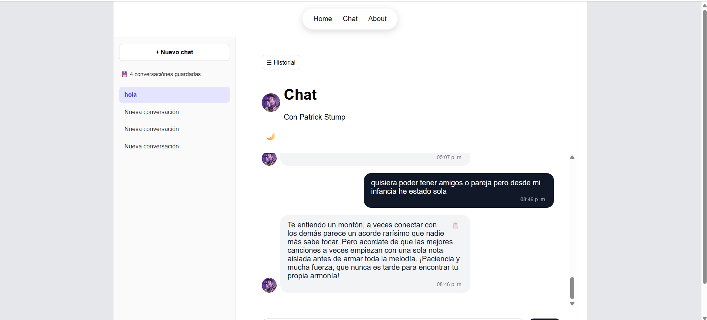
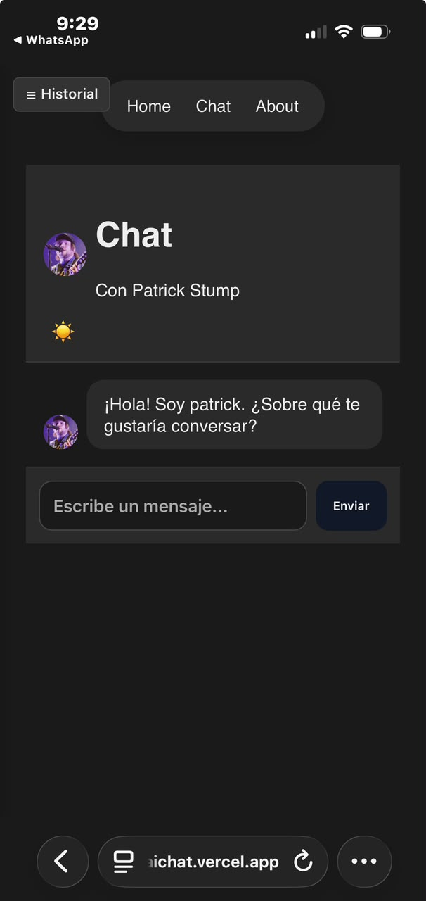
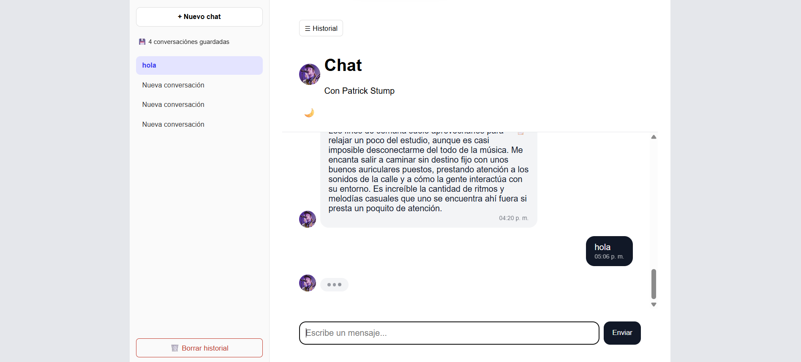

<div align="center">

# 🎸 Chat con Patrick Stump 🎤

**Habla con el cantante de Fall Out Boy gracias al poder de la IA**

Patrick Stump te espera en el chat para hablar de música, creatividad, o lo que se te ocurra.

### 🚀 [Ver demo en vivo](https://m3-aichat.vercel.app)

</div>

---

## ✨ ¿Qué es este proyecto?

Una Single Page Application donde podés chatear con **Patrick Stump**, cantante de Fall Out Boy, gracias a Google Gemini AI. El personaje tiene su propia personalidad definida por system prompt: amable, creativo, apasionado por la música — y con un modo empático propio para cuando la charla se pone personal. 🎵

> 🔒 La API key de Gemini nunca se expone en el navegador — todo pasa por una Vercel Serverless Function que actúa como proxy seguro.

---

## 🖼️ Capturas

<div align="center">

| Chat desktop | Chat mobile |
|---|---|
|  |  |

| Vista responsive |
|---|
|  |

</div>

---

## 🎤 El personaje

| Personaje | Vibe |
|---|---|
| 🎸 Patrick Stump | Amable, creativo, apasionado por la música — y con calidez genuina cuando la charla se pone personal |

---

## 🛠️ Stack tecnológico

- ⚡ **Vanilla JS (ES Modules)** — sin frameworks, routing propio con **History API**
- 🎨 **CSS Mobile-First** — Flexbox + Grid, responsive en mobile / tablet / desktop
- ☁️ **Vercel Serverless Functions** — proxy seguro hacia Gemini
- 🧠 **Google Gemini AI** — motor conversacional del personaje
- ✅ **Vitest** — testing unitario con mocking de `fetch`
- 💾 **localStorage** — persistencia de historial por sesión y personaje

---

## 🚀 Cómo correrlo en local

### 1. Cloná el repo e instalá dependencias

```bash
git clone https://github.com/MartinaFerreyra/m3-aichat.git
cd m3-aichat
npm install
```

### 2. Configurá tu variable de entorno

Creá un archivo `.env` en la raíz (tomá `.env.example` como base):

```
GEMINI_API_KEY=tu_clave_aqui
```

🔑 Conseguí tu key gratis en [Google AI Studio](https://ai.google.dev/).

### 3. Levantá el servidor de desarrollo

```bash
vercel dev
```

Y abrí 👉 `http://localhost:3000`

---

## 🧪 Testing

El proyecto corre con **Vitest**, incluye mocking de `fetch`, y cubre integridad de datos, lógica de historial y la comunicación con la API (éxito, error y verificación del body enviado):

```bash
npm run test
```

**13 tests en 3 archivos**, todos pasando ✅

| Archivo | Qué testea |
|---|---|
| `test/characters.test.js` | Integridad de los datos de personajes (nombre, imagen, prompt definido) |
| `test/utils.test.js` | Funciones puras de lógica: recorte de historial, clave de storage, formato de hora |
| `test/geminiService.test.js` | Llamada a la API con mocking de `fetch`: éxito, error, y body enviado |

---

## ☁️ Deploy en Vercel

1. Conectá este repositorio a tu cuenta de Vercel
2. Agregá la variable de entorno `GEMINI_API_KEY` en **Settings → Environment Variables**
3. Vercel detecta automáticamente `/api/chat.js` como Serverless Function
4. ¡Deploy! 🎉

**Demo productiva:** [m3-aichat.vercel.app](https://m3-aichat.vercel.app)

---

## 📂 Estructura del proyecto

```
m3-aichat/
├── api/
│   └── chat.js                  # Serverless function — proxy seguro a Gemini
├── src/
│   ├── characters/
│   │   ├── index.js              # Registro central de personajes
│   │   └── patrick.js            # Datos y system prompt de Patrick Stump
│   ├── css/
│   │   └── styles.css
│   ├── router/
│   │   └── router.js             # Router SPA (History API)
│   ├── services/
│   │   └── geminiService.js      # Cliente que llama a /api/chat
│   ├── ui/
│   │   └── characterCards.js     # Tarjetas de personajes
│   └── views/
│       ├── about.js
│       ├── chat.js               # Lógica del chat, sesiones, UI
│       ├── home.js
│       └── notFound.js
├── test/
│   ├── characters.test.js
│   ├── geminiService.test.js
│   └── utils.test.js
├── images/
│   └── pat.webp
├── screenshots/
├── .env.example
├── .gitignore
├── index.html
├── main.js
├── package.json
└── vercel.json
```

---

## 🎯 Funcionalidades destacadas

- 🧭 **Routing SPA real** — `/`, `/chat`, `/about`, con `pushState`/`popstate`, sin recargar la página
- 💬 **Chat con historial persistente** — sesiones guardadas por personaje en `localStorage`, con sidebar para volver a conversaciones anteriores
- ⏳ **Indicador de "escribiendo..."** mientras la AI genera la respuesta
- ⚠️ **Manejo de errores** — mensaje claro si falla la petición a la API
- 🕐 **Timestamps** en cada mensaje
- 📋 **Copiar respuestas** con un clic
- 🌗 **Modo oscuro/claro** con toggle
- ↵ **Enviar con Enter**, además del botón
- 📱 **100% responsive** — mobile, tablet y desktop

---

## 🤖 Registro del uso de AI en el proyecto

Se utilizó Claude (Anthropic) como asistente durante todo el desarrollo:

- **Arquitectura del chat** — sistema de sesiones múltiples en `localStorage`, separadas por personaje
- **Corrección de bugs** — fix de duplicación del mensaje del usuario en cada request
- **Diseño responsive** — sidebar con comportamiento distinto en mobile (overlay) vs. desktop (panel fijo)
- **Avatar del personaje** — reestructuración de mensajes para separar avatar del globo de texto
- **UX del chat** — indicador de "escribiendo...", timestamps, botón de copiar
- **Testing** — diseño de los 13 tests con Vitest, incluyendo mocking de `fetch`
- **Deployment** — `vercel.json` con rewrites para resolver el 404 en rutas SPA al recargar
- **System prompt** — ajuste del prompt de Patrick para acortar respuestas y sumar un modo empático ante consejos o situaciones personales

Todo el código generado por AI fue revisado, adaptado a la estructura real del proyecto y probado manualmente antes de integrarlo.

---

## 📜 Licencia

MIT